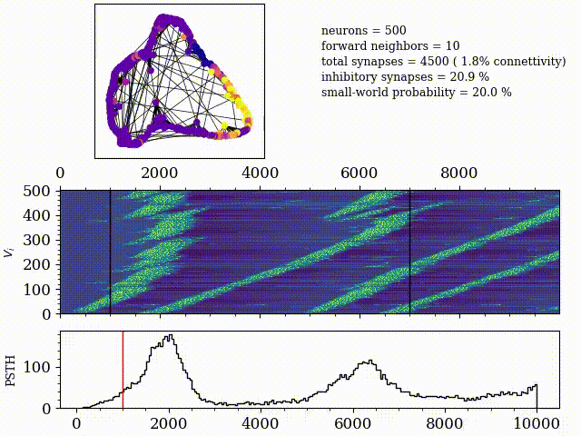

## Numneur
A **low-level** repo for **neural dyamics** simulation in **Cython**.

Mainly composed of 4 modules:

- `neur`: simulation of dynamical systems (neurons, networks, 2D oscillators, etc.)
- `networks`: build the abstract structure of the graph for networks (small-wold, Barabasi-Albert, etc.)
- `stochastic`: some stuff for implementing stochastic processes (thresholded OU, Poisson)
- `chem`: mainly Gillespie for ionic channel dynamics

Why not just use a simulator ?:

- simulators, though easier to use and multi-platform comaptible, are slow due to the **high level** of structures
- easier to define **non-standard models**
- easier to follow **numerical subtleties**
- more **fun**

## Compilation and suggested enviroment

Setup the environment using `pipenv`

```
pipenv install
pipenv shell
```

then compile with

```
make
```

or 

```
make hardcore
```

(see [here](https://github.com/djanloo/cythonTemplate) for more details on Cython compilation options).

### Examples


### Euler vs RK4
Explicit Euler is roughly three times faster than RK4 and does not show great differences, apart from a slightly different timescale


### Networks


